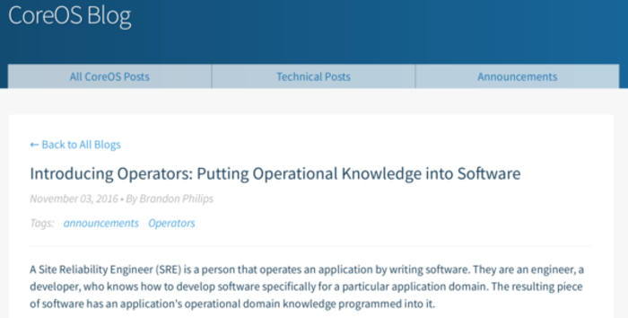
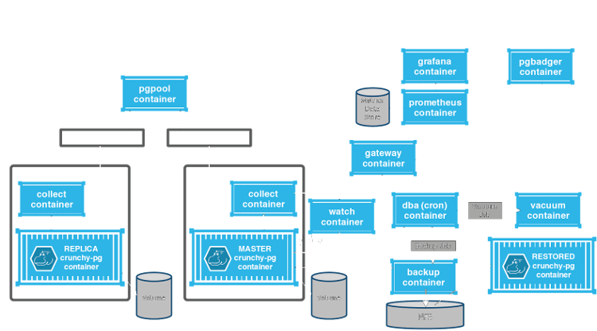

## pgKubernetes Tutorial


.sigblock[
Josh Berkus

Red Hat OSAS

OSCON 2018
]

.leftlogo[]

---


### Thanks, Zalando!

---

## who is this for?

If you:

* Have some basic admin/devops skills
* Know how to *use* PostgreSQL
* Have some passing experience with Docker ...

---

## who is this for?

* Want to be able to deploy a very basic configuration on Kubernetes somewhere
* Want to know enough to explore more on your own

... this is for you.

---

# what isn't it?

* a general Kubernetes/OpenShift tutorial
* an in-depth PostgreSQL HA workshop
* training in general PostgreSQL administration
* hacking on Patroni, Spilo, or the Postgres Operator(s)

---

## TOC

* Intro
* Stateful Apps on Kubernetes
* Trade-Offs
* Use Cases
* What's Patroni
* Inside the Container
* Deploying
* Management
* Going Further

---

## TOC

.left-column[
* Intro
* Stateful Apps
* Trade-Offs
* Use Cases
* What's Patroni
* Inside Container
* Deploying
* Management
* Going Further
]

.right-column[
* Talking
* Talking
* Talking
* Discussion
* Talking
* Doing Stuff
* Doing Stuff
* Doing Stuff
* Talking
]

---

## Prepare for the Exercises

1. Install minikube
2. Install kubectl
3. Download containers
4. Sync the github repo

github.com/jberkus/pgKubernetes

---


### Stateful Kubernetes

---

## First: ReplicaSet

```
kind: ReplicaSet
metadata:
  name: frontend
  labels:
    app: guestbook
spec:
  replicas: 3
  template:
    spec:
      containers:
      - name: php-redis
        image: gcr.io/google_samples/gb-frontend:v3
```

---

## First: ReplicaSet

* a "set" of identical Pods
* easy LB connections via a Service
* scale up and down
* ensure replacement

---


---

## ReplicaSet Limitations

* no reliable way to connect to individual pods
* ... or between pods
* storage is shared/reused
* pod identity is unstable

---

## 2nd: StatefulSet

Added in Kubernetes 1.4

* Stateful Identity
* Stateful Routing
* Stateful Storage

---

## StatefulSet Identity

```
[centos@ip-172-31-45-224 ~]$ kubectl get pods
NAME            READY     STATUS    RESTARTS   AGE
etcd-0          1/1       Running   0          5d
etcd-1          1/1       Running   0          5d
etcd-2          1/1       Running   0          5d
patroni-0       1/1       Running   0          2d
patroni-1       1/1       Running   0          2d
patroni-2       1/1       Running   0          2d
patroni-3       1/1       Running   0          2d
patroni-4       1/1       Running   0          2d
```

---

## StatefulSet Identity

* Names for each pod
* Sequentially numbered
* Start up in sequential order

---

## StatefulSet Routing

* LB routing to whole set as `service.svc.cluster.local`
* Routing to each pod as `pod-0.service.svc.cluster.local`

---

## StatefulSet Storage

1. Create Persistent Volumes (PVs)
2. Define PV Templates (PVTs)
3. At deployment, each pod gets a PV Claim (PVC).

---

## StatefulSet Storage

```
[root@ip-172-31-47-16 ~]# kubectl get pvc
NAME               STATUS  CAPACITY   AGE
pgdata-patroni-0   Bound   25Gi       59m
pgdata-patroni-1   Bound   25Gi       59m
pgdata-patroni-2   Bound   25Gi       59m
```

---

## StatefulSet Storage

* PVCs are per-pod
* PVCs do not get garbage-collected
* Scheduler tries to deploy pod to existing PVC

---

## What's missing from StatefulSets?

* Cluster Role (e.g. "master")

This has to be implemented in the database app.

---

## 3rd: CRDs & Operators

Added in Kubernetes 1.8

**Custom Resource Definition:** a "plugin"

**Operator:** automation for apps, implemented as a CRD.

---



---

## Operators for DBs

*Take everything a junior DBA would do and make it code instead*

---

## Operators for DBs

*Take everything your Puppet Postgres Manifest is doing and make it a Kubernetes Object*

---

## Operators + CRDs

* DB pods
* services
* config information
* storage

---

## The Current Stack

A database cluster<br />
Managed by an Operator<br />
Implemented as a CRD<br />
Running a StatefulSet<br />
On Kubernetes

---


### Trade-Offs

---

## 2 Points:<br />Many Small Databases<br />vs<br />One Giant Database

---

## Simple Deployment<br />vs<br />Customized Deployment

---

## DevOps Automation<br />vs<br />Shelling In

---

## Team Self-Service<br />vs<br />DBA Control

---

## Scaling Services<br />vs<br />Performance Tuning

---

## Automated HA<br />vs<br />Manual Failover

---

## Scoring Up

---


---


---


---

## Performance Penalties

* Overlay network latency
* Storge abstraction
* Limits on large databases (cgroups)

---


### High Availability Options

---

## Non-Cloud

* **repmgr**: log-based system<br />
  uses watchdog setup
* **pgPool2**: proxy-based system<br />
  sporkism issues
* **HandyRep**: my pre-Kube system<br />
  please don't use

---

## Paid Cloud

* RDS
* Postgres Aurora
* Google Cloud SQL
* Azure PostgreSQL

---

## Why Kubernetes?

1. Portlability
2. On-prem
3. Custom Postgres
4. $$$$

---

# Kubernetes Solutions

* Patroni/Spilo<br />
* Crunchy Postgres Operator<br />
* Stolon<br />

---



---


---


### Use-case: Zalando.com

---

## Zalando Use-Case

- top fashion retailer
- AWS-based cloud
- self service for devs
- manage 100's of databases

---


### Use-case: Bugs.python.org

---

## Python Use-Case

- Wanted to host on OpenShift.io
- Needed HA
- Didn't want RD$
- Crunchy too complex for small DB

---

## Use-cases:<br />Yours

---

## The 80% Solution

* Small DBs
* Fully automated HA
* Availability-first
* Kubernetes Load-Balancing
* AWS-friendly

---

## Some Terms

**Patroni**: an HA daemon in Python

**Spilo**: a container image containing Patroni + Postgres, plus utilities

---

## Patroni

in-container daemon that:

* controls PostgreSQL start/stop/replication
* automates failover
* supplies a management API

---


---

# why?

1. Simplicity
2. Usability
3. Availability

---

## simplicity goals

* One container image
* Rely on Kubernetes
* "just works" defaults

---

## useability

* Management port (8008)
* Configuration & plugins
* No limitations on Postgres

---

## availability

Fully automated replication and failover

---


### Manual Deployment

---

## Deploy Patroni

1. Create StatefulSet
2. Create Endpoints
3. Create Service
4. Create Secret
5. Create ServiceAccount

---


---


---


---


---


---


---


---


---

#### Initial Cluster Tour

---


### Failover

---


---


---


---


---


---


---


---

## failover

1. Master vanishes
2. Replicas grab lock (Endpoint)
3. Winner checks replication status
4. Update configmap
5. Replicas re-master

---

#### Try failover

---


### Operators

---

## Why?

* self-documenting clusters
* all config available via the Kubernetes API
* no kube-yaml required for deployment
* DBs require scheduled work, etc.

---

## why?

if I have to create a manifest anyway, why not
have it run everything?

---

## Spilo Operator

1. Install operator
2. Create manifest for each cluster
3. Modify manifest to modify cluster

---

#### Try Operator

---


### Tour De Container

---

## Connecting to PostgreSQL

2 Services:

1. Read-only: all nodes
2. Read-write: current master

application needs to handle both, or just use RW

---

## Connecting to PostgreSQL

Get passwords from Secrets

```
dbuser = PATRONI_USER_USERNAME
dbpass = PATRONI_USER_PASSWORD
```

---

## Try Connecting

---


### Management

---

## DevOpsing Your DB

1. Use operators
2. Create your own containers
3. Create manifest templates
4. Create a workflow for deployment

---

## What about DB Contents?

Well, that's why we have ORMs

---

## Patroni Configuration

* controls how patroni runs
* and how PostgreSQL runs
* part of your container image
* plus pass in ENV

---

## Examine Patroni Config

---

## Administration API

* Port 8008
* For command & control
* Use PatroniCTL

---

## API Commands

* config
* status
* manual failoer
* change postgres config

---

## Try API commands

---

## Operator Configuration

1. Create manifest for cluster
2. Operator deploys async
3. Configure other behavior

---

## Try Operator Config

---

## Now shut everything down

* delete operator cluster
* delete operator
* delete patroni cluster
* delete patroni configmaps
* stop minishift

---


### More Stuff

---

## OpenShift vs. Kubernetes

* both are Kubernetes
* OpenShift: more user-friendly
* Kuberenetes: more cutting-edge

---

## OpenShift vs. Kubernetes

OpenShift doesn't allow changing Endpoints

`use_endpoints=false`

---


---

## Near-future Work

* support Sync Quorum
* federation
* non-AWS operator + image
* logical replication upgrades
* gluster-based demo template
* performance testing

---

## Crazy Ideas

* custom workload using workloads API
* add scheduleable cronjobs to operator
* integrate IPVS load-balancing

---

## contributors wanted!

github.com/zalando/patroni

postgres-slack.herokuapp.com<br />
\#patroni

slack.k8s.io  #sig-apps

---

## other resources

* patroni.readthedocs.io
* spilo.readthedocs.io
* github.com/zalando-incubator/postgres-operator
* github.com/zalando/spilo/
* github.com/CrunchyData/postgres-operator

---


### Kubernetes Party Wednesday 7pm!

---

# ¿questions?

.left-column-narrow[
more<br />jberkus:

Red Hat:

&nbsp;
]

.right-column-wide[
@fuzzychef<br />
www.databasesoup.com<br />
jberkus.github.io

community.redhat.com

&nbsp;
]

.leftlogo[]

.rightlogo[]
